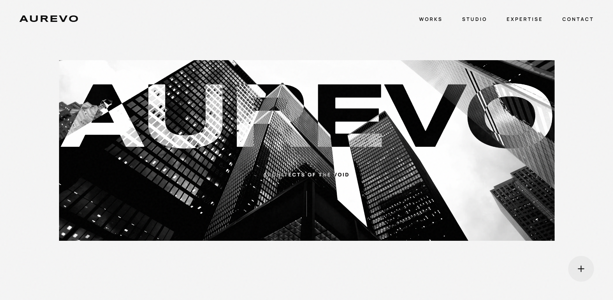
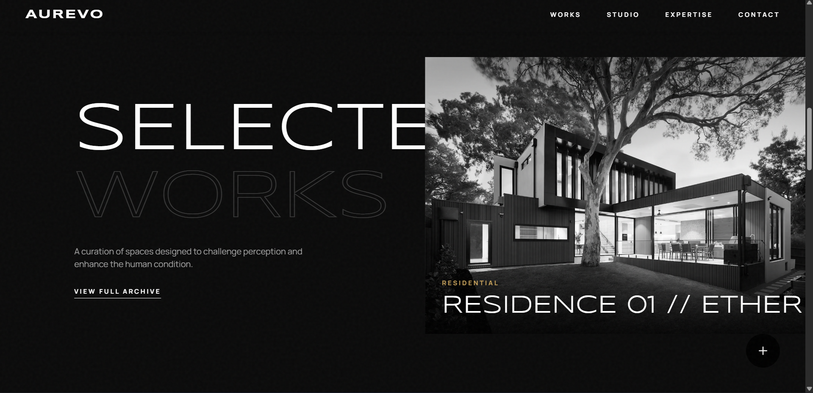
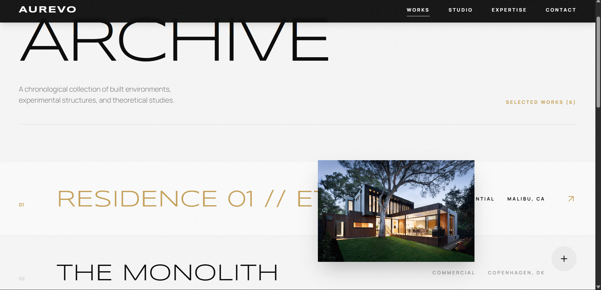
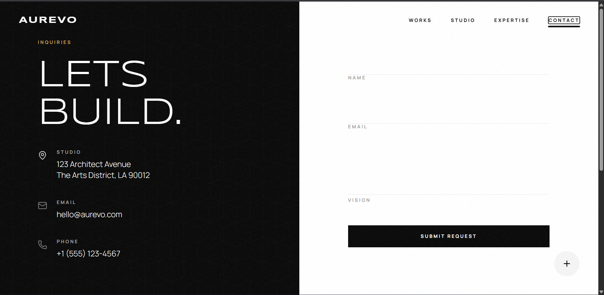

<div align="center">

# AUREVO

**Kurumsal ve tanıtım siteleri için hazırlanmış, animasyon odaklı bir React frontend template'i.**

[](https://es-aurevo.vercel.app/)


[**→ Canlı Demo**](https://es-aurevo.vercel.app/)

</div>

<br/>

## Genel Bakış

Aurevo, sektörden bağımsız kurgulanmış bir React SPA iskeletidir. İçerik, renk paleti ve sayfa metinleri değiştirilerek farklı firma ve sektörler için hızlıca uyarlanabilecek şekilde tasarlanmıştır; bu repodaki hâli, kurgusal bir mimari stüdyo örneği üzerinden şablonu sergiler.

Odak noktası, bir ürün değil frontend mühendisliğidir: route geçişleri, scroll etkileşimleri ve tipografi ağırlıklı bir tasarım dilinin nasıl kurulacağını gösterir.

<br/>

## Öne Çıkanlar

- **Sayfa geçiş animasyonları** — `react-router-dom` + `framer-motion` `AnimatePresence` ile route değişimlerinde fade/slide geçişleri
- **Yatay scroll galeri** — dikey scroll'u yatay harekete çeviren `useScroll` / `useTransform` kurgusu
- **Mouse-takipli önizleme** — imleci takip eden, spring fizikli görsel önizleme kutusu
- **Scroll'a duyarlı navigasyon** — sayfaya ve scroll pozisyonuna göre durumunu değiştiren, tam ekran mobil menülü navbar
- **Uyarlanabilir tasarım sistemi** — özel Tailwind teması ve tipografi ölçeği; renk paleti ve içerik `constants.ts` üzerinden değiştirilerek farklı markalara giydirilebilir

<br/>

## Ekran Görüntüleri

<table>
<tr>
<td width="50%"></td>
<td width="50%"></td>
</tr>
<tr>
<td width="50%"></td>
<td width="50%"></td>
</tr>
</table>

<br/>

## Teknoloji Yığını

| Katman | Teknoloji |
|---|---|
| Framework | React 19 + TypeScript |
| Build Tool | Vite 7 |
| Routing | React Router 7 (`HashRouter`) |
| Animasyon | Framer Motion |
| Stil | Tailwind CSS |
| İkonlar | Lucide React |

<br/>

## Proje Yapısı

```
├── App.tsx              # Router, Layout ve sayfa geçiş yönetimi
├── constants.ts         # İçerik: kartlar, ekip, hizmetler — uyarlama noktası
├── types.ts             # Paylaşılan TypeScript arayüzleri
├── components/
│   ├── Navbar.tsx        # Scroll/sayfa duyarlı navigasyon
│   ├── Footer.tsx        # Marka, navigasyon ve sosyal bağlantılar
│   └── QuoteModal.tsx    # Teklif talep formu (modal)
└── pages/
    ├── Home.tsx           # Hero + yatay scroll vitrin
    ├── About.tsx          # Tanıtım ve ekip
    ├── Projects.tsx        # Tam liste/arşiv görünümü
    ├── Services.tsx        # Hizmet/ürün listesi
    └── Contact.tsx          # İletişim formu
```

<br/>

## Yerel Kurulum

**Gereksinim:** Node.js

```bash
npm install
npm run dev
```

Production build:

```bash
npm run build
npm run preview
```

<br/>

## Notlar

- Form gönderimleri arayüz düzeyinde tamamlanmıştır; backend entegrasyonu kullanım senaryosuna göre eklenmesi beklenen bir adımdır.
- Görseller `pages/Home.tsx` ve `pages/About.tsx` içinde harici URL üzerinden, geri kalanı `components/assets` altından yüklenir — üretim kullanımında hepsinin markaya özel varlıklarla değiştirilmesi beklenir.

<br/>

---

<div align="center">

**Emirhan Sezgin**

</div>
